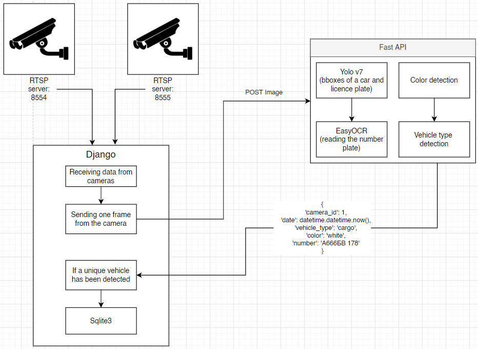
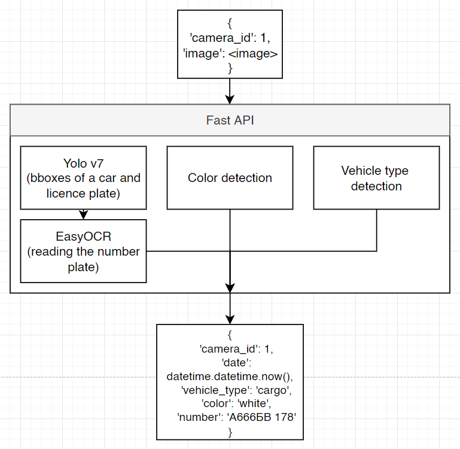

<h1 align="center">Licence plate detection</h1>
<hr>
The project is made as part of a deep learning course at ITMO University. The goal is to train and deploy a NN model for licence 
plate recognition. 

<p align="center"></p>
<p align="center">Overall scheme of a project</p>

<h2 align="center">Training</h2>
<hr>
<h3>Dataset collection</h3>
The dataset was downloaded from <a href="https://storage.googleapis.com/openimages/web/download.html">Open Images Dataset v6</a> using self written script, based on <a href="https://github.com/DmitryRyumin/OIDv6">OIDv6</a> package.
The main difference is that OIDv6 doesn't allow to download images, containing both "Car" and "Vehicle licence plate" classes on a single picture. 

WARNING! In order to launch the script, the annotations file ``./boxes/oidv6-train-annotations-bbox.csv``  has to be in place.

```
cd dataset
conda create -n download_oidv6
pip install -r requirements.txt
python3 download_dataset.py
```
After the script has finished, the dataset with 4000 images was loaded into the <a href="https://roboflow.com/">Roboflow</a>.

<h3>Training Yolov7</h3>
The training process of Yolov7 was done in Google Colab notebook <a href="">(link)</a>. 
It took almost 3 hours to complete 55 epochs.
<p align="center"></p>

<h2 align="center">Modules</h2>
<hr>
There are three main modules which can be launched independently in an infinite amount in order to reach maximum scalability:
<ul>
<li>Camera;</li>
<li>Detection;</li>
<li>Server.</li>
</ul>

<h3>Camera</h3>
The camera stream is using a RTSP server, which is launched on a separate Docker container.
For testing purpose, the camera is loop-streaming a short, 10 seconds video, ``./camera/car_video.mp4``. In order to launch:
```
cd camera
docker-compose up --build
```

<h3>Detection</h3>
The detection module is wrapped around Fast API service. The main task of the module is to receive a POST request, 
containing an image and a camera id ``{'camera_id': 1, 'image': <image>}``, 
process it, and return a json-type data, which contains the following:
<ul>
<li>camera_id;</li>
<li>date;</li>
<li>vehicle_type;</li>
<li>color;</li>
<li>number.</li>
</ul>

<p align="center"></p>
<p align="center">The scheme of a detection module</p>

In order to launch:
```
conda create -n detection python=3.7
pip install -r requirements.txt
```

<h3>Server</h3>
Yet to be done
