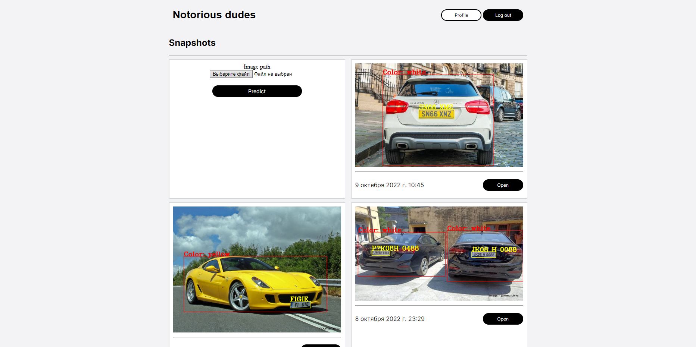

<h1 align="center">Django-based web service for licence plate detection.</h1>
<p align="center"></p>

The web-service is a part of both <a href="github.com/arthurkazaryan/licence_plate_detection">licence plate detection</a> and <a href="github.com/arthurkazaryan/text_comparison">text comparison</a> projects.

<br>
For licence detection, it allows users to send an images via the interface to Detection API and plot the results for licence detection.
<p align="center"></p>

<br>
For text comparison, it allows users to send some text information to Text Comparison API and save the results to database.
<p align="center"></p>

<br>

In order to launch make sure to be located at ``./licence_plate_detection/database_project`` directory.

First launch:
```
conda create -n django_database python=3.7
conda activate django_database
pip install -r requirements.txt
python manage.py makemigrations
python manage.py migrate
python manage.py runserver
```

Second and subsequent launches:
```
conda activate django_database
python manage.py runserver
```

<b>Note:</b> for licence plate detection only image-based detection is available by the current interface.
