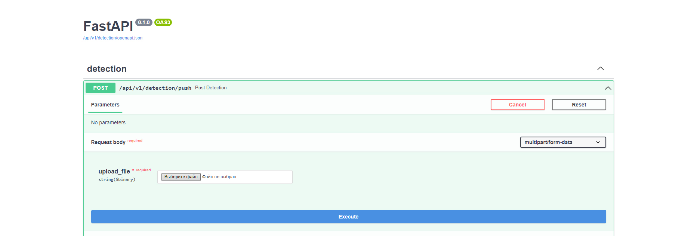
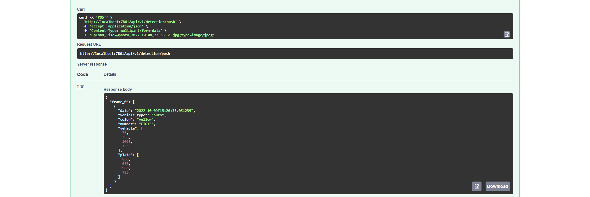

<h1 align="center">FastAPI based service for licence plate detection.</h1>

The Fast API interface can be accessed after launching at: ``http://localhost:7861/api/v1/detection/docs``
<p align="center"></p>
<br>

Only image and video files can be processed correctly when being loaded into service.

After the data is processed, it returns a dictionary with the frame id and car data if found.
<p align="center"></p>
<br>

In order to launch make sure to be located at ``./licence_plate_detection/detection`` directory.

First launch:
```
conda create -n detection python=3.7
conda activate detection
pip install -r requirements.txt
python launch_api.py
```

Second and subsequent launches:
```
conda activate detection
python launch_api.py
```

<hr>

To run on a video:

```
python create_video.py --file_path=<PATH_TO_FILE>
```

<b>Note: </b> make sure the API is launched before running the script.
